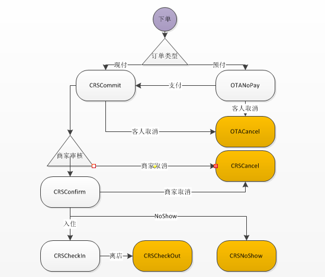

### 系统固定编码.
1. [订单状态](#订单状态)
1. [订单类型](#订单类型)
1. [卡券种类](#卡券种类)
1. [付款方式](#付款方式)

#### 订单状态
1. 订单状态决定数据流向.
```
public static final String OTANoPay = "OTANoPay";           //OTA未支付
public static final String OTACancel = "OTACancel";         //OTA取消客人取消

public static final String CRSCommit = "CRSCommit";         //CRS已提交
public static final String CRSConfirm = "CRSConfirm";       //CRS已确认
public static final String CRSCancel = "CRSCancel";         //CRS取消,客人取消
public static final String CRSCheckIn = "CRSCheckIn";       //CRS已入住
public static final String CRSCheckOut = "CRSCheckOut";     //CRS已退宿
public static final String CRSNoShow = "CRSNoShow";         //CRSNoShow, 超时订单

public static final String PMSCommit = "PMSCommit";          //PMS已提交
public static final String PMSConfirm = "PMSConfirm";          //PMS已确认,导入预定表
public static final String PMSCancel = "PMSCancel";          //PMS取消, 商家取消
public static final String PMSCheckIn = "PMSCheckIn";        //pms入住
public static final String PMSCheckOut = "PMSCheckOut";      //pms退宿
public static final String PMSNoShow = "PMSNoShow";          //pms NoShow
```


#### 订单类型.
1. 订单类型决定业务流程.
1. 不同订单类型使用不同的网关接口.
```
//客房订单类型
public static final String roomType = "roomType";           //定房型
public static final String roomId = "roomId";               //定房间号
//康乐订单类型
public static final String kldc = "2";                      //餐厅点餐
public static final String klyd = "3";                      //餐厅预订
public static final String klwm = "4";                      //餐厅外卖
public static final String klsc = "5";                      //康乐微商城
public static final String klTicket = "6";                  //康乐微电子票
public static final String kldb = "7";                      //餐厅打包
public static final String klyy = "klyy";                   //包间挂号预约,

```


#### 卡券种类.
#### 活动代码.
#### 付款方式.
```
public static final String paykind_weixin = "0";                //网上微信
public static final String paykind_wxPay = "1";                 //微信扫描
public static final String paykind_aliPay = "2";                //支付宝扫描
public static final String paykind_xinyongzhu = "4";            //信用住
public static final String paykind_tuangou = "T";               //团购
public static final String paykind_youhui = "Z";                //优惠支付方式
public static final String paykind_chuzhika = "F";              //储值卡支付方式
public static final String paykind_rmb = "A";                   //现金
public static final String paykind_djq = "D";                   //代金券付款方式
```